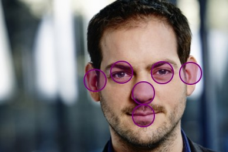

# Image Crop Positioner WordPress plugin

This plugin allows you to better crop your images, based on face detection or hotspot selection.

## In Development

> :warning: **This plugin is still in development.** Some functionality may be missing or not working as intended.

## Menu

- [Requirements](./docs/requirements.md)
- [Installation instructions](./docs/installation.md)
- [Faces detection](./docs/faces-detection.md)
- [Hotspot selection](./docs/hotspots-selection.md)
- [Migrators](./docs/migrators.md)
- [WP-CLI Commands](./docs/wp-cli-commands.md)
- [Developing](./docs/developing.md)
- [Automated testing](./docs/automated-testing.md)

## Do you like this plugin?
That's amazing to hear! I attempt to keep it up to date as best as I can. However, it's a spare-time project that I mostly work on in the evening ours.
Would you like to support me, feel free to do a small donation so I can drink some coffee ☕.

[Donate a cup of coffee ☕ (via PayPal or Credit/Debit Card)](https://www.paypal.com/donate/?hosted_button_id=9NSDQCQYNZUB6)

## Example images

### Faces detection

### Hotspots selection

