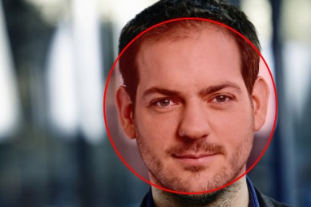

# Faces detection

This plugin has the option to detect faces in images.
There are two ways to detect faces in your image.
You can detect faces via PHP or via JavaScript.

## Face detection via PHP (only supports 1 face)

When using face detection via PHP, the face detection is all done on your webserver.
Your images will not be uploaded to any external platform.
Our PHP face detection code is a modified version of the [softon/laravel-face-detect library](https://github.com/softon/laravel-face-detect).

## Faces detection via JavaScript (supports multiple faces)

When using face detection via JavaScript, the face detection is all done on your own device.
Your images will not be uploaded to any external platform.
Our JavaScript faces detection uses the [jaysalvat/jquery.facedetection](https://github.com/jaysalvat/jquery.facedetection).
